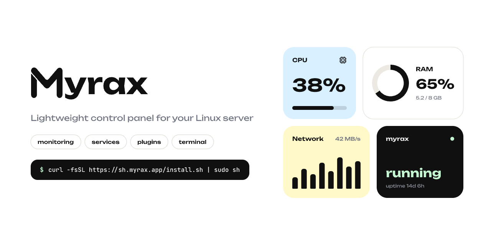
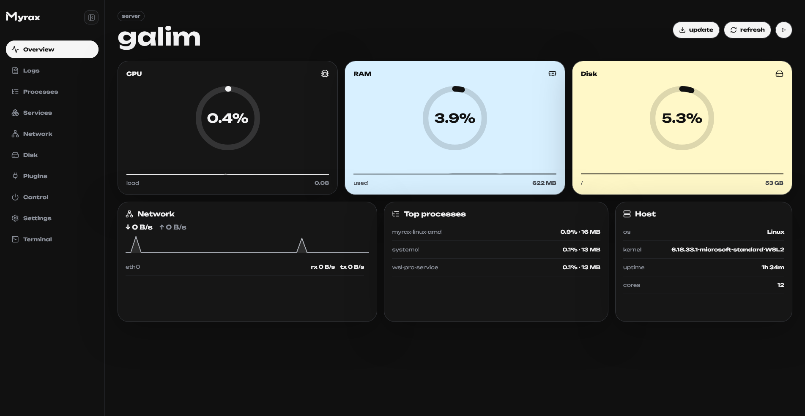
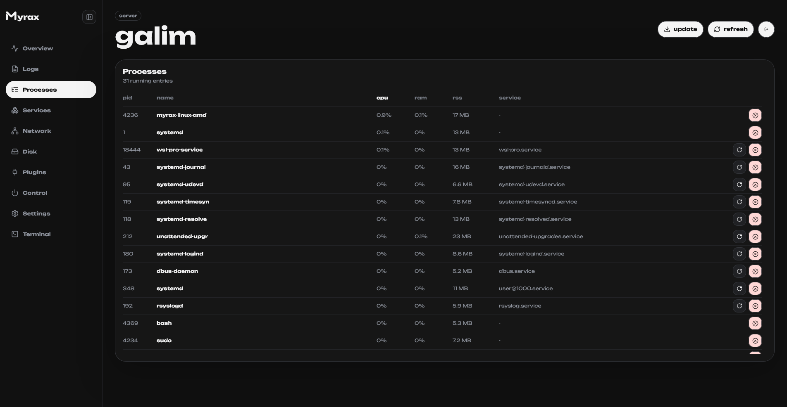
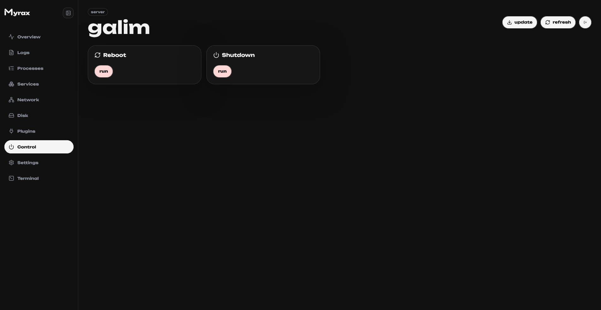
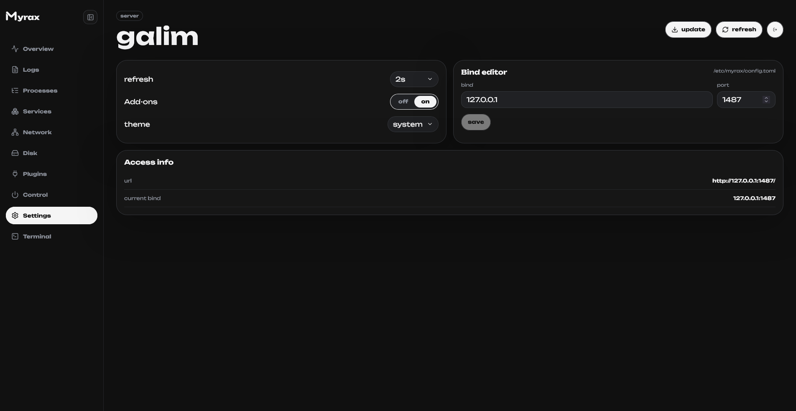

  

# Myrax

Lightweight control panel for Linux servers. One Go binary, no database, no docker —
realtime metrics, processes, services, network, disk and a plugin system, all in a fast web UI.

  
  
  

Project is no longer supported

## Screens

  
  
  
  

